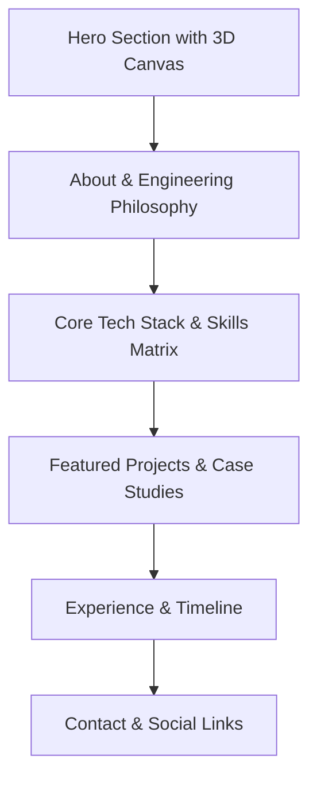

# Modern 3D Personal Portfolio — Implementation Plan

> **Goal:** Transform `hamedhajiloo.github.io` into a high-end, modern, and interactive 3D personal website showcasing backend (.NET) and software engineering expertise with fluid WebGL visuals, clean typography, and responsive micro-interactions.

---

## 1. Visual & Interactive Concept

### Aesthetic Direction
- **Theme:** Dark futuristic / Glassmorphism with deep navy/charcoal base (`#0b0f19`), subtle violet/cyan glow accents (`#6366f1`, `#06b6d4`), and crisp high-contrast typography.
- **Vibe:** Sleek developer aesthetics, engineering precision, modern smooth micro-interactions.
- **Typography:** Modern clean sans-serif (Inter / Plus Jakarta Sans) paired with a monospace accent font (JetBrains Mono / Fira Code) for code & tech badges.

### 3D Visual Experience (Three.js)
- **Hero Canvas:** Interactive 3D particle constellation / floating geometric .NET-inspired node cluster or interactive wave sphere.
- **Interactivity:**
  - Mouse movement parallax and rotational drift.
  - Interactive click / hover ripples and depth scaling.
  - Smooth camera pan / zoom on scroll transitions between sections.
- **Performance Optimization:**
  - Automatic frame throttling when out of viewport.
  - Mobile fallback / reduced particle count to maintain steady 60 FPS across devices.

---

## 2. Information Architecture & Sections

### Section Breakdown
1. **Header & Navigation**
   - Floating glassmorphic navbar with smooth scroll links and active section indicator.
   - Quick resume download and GitHub links.
2. **Hero Section**
   - Immersive 3D WebGL background canvas.
   - Dynamic role typing effect ("Senior .NET Developer", "Cloud & Microservices Architect", "System Designer").
   - Call to action buttons ("Explore Work", "Get in Touch").
3. **About Me / Bio**
   - Clean split-layout: Profile spotlight with ambient glow + bio narrative highlighting .NET, architecture, and engineering principles.
4. **Skills & Tech Stack Showcase**
   - Interactive badge grid / categorized cards (C#, .NET Core, ASP.NET, EF Core, Microservices, SQL, Docker, Azure/Cloud).
   - Proficiency & experience badges with hover tilt effect.
5. **Interactive Projects & Portfolio**
   - Card layout with 3D tilt hover physics (`vanilla-tilt` / CSS 3D transforms).
   - Tags, live demo links, repository buttons, and architecture highlights.
6. **Experience / Journey Timeline**
   - Vertical interactive timeline showing career milestones, achievements, and open-source contributions.
7. **Contact & Footer**
   - Glassmorphic contact cards, direct email, Telegram, Twitter/X, and GitHub profile connections.

---

## 3. Technology Stack & Dependencies

| Layer | Library / Tool | Purpose |
|---|---|---|
| **3D & Graphics** | `three.js` (r128+) | 3D scene, shaders, particle systems, interactive canvas |
| **Animations** | `gsap` (GreenSock) + `ScrollTrigger` | Butter-smooth scroll animations, text reveals, timeline transitions |
| **Icons** | `Lucide Icons` / `FontAwesome 6` | Clean modern vector iconography |
| **Layout & Styling** | Modern CSS3 (Grid, Flexbox, Custom Properties, Backdrop Filter) | Responsive design, glassmorphism, zero bulky legacy dependencies |
| **Cards & Physics** | Vanilla CSS 3D / Lightweight tilt | Modern tactile card hover interactions |

---

## 4. Phased Implementation Roadmap

### Phase 1: Foundation & Design System Setup
- [ ] Establish CSS variables for colors, typography, glassmorphism tokens, and responsive spacing.
- [ ] Set up Google Fonts (`Inter` + `JetBrains Mono`).
- [ ] Clean up legacy dependencies (remove outdated jQuery/carousel bloat where modern native CSS/JS can take over).

### Phase 2: 3D Scene & WebGL Engine
- [ ] Build `js/three-scene.js`:
  - Three.js Scene, Perspective Camera, and WebGL Renderer with antialiasing and alpha channel.
  - Interactive 3D particle swarm / connected node constellation.
  - Mouse coordinate tracking and smooth lerped camera rotation.
  - Window resize handler and WebGL context loss protection.

### Phase 3: Modern UI Sections Construction
- [ ] Build the Glassmorphic Navigation Bar.
- [ ] Construct the Hero section with dynamic headline and glowing action triggers.
- [ ] Implement the Skills Matrix with modern categorized tags and animated progress rings.
- [ ] Implement Project Showcase Cards with 3D perspective hover effects.
- [ ] Implement Experience & Milestone Timeline.
- [ ] Design Contact Section with interactive copy-to-clipboard and social links.

### Phase 4: Scroll Animations & Polish (GSAP)
- [ ] Add reveal animations on scroll (`fadeInUp`, stagger effects for cards and skill badges).
- [ ] Add micro-interactions (magnetic buttons, glowing borders on focus, smooth anchor scrolling).

### Phase 5: Testing, Optimization & Deployment
- [ ] Test cross-browser compatibility (Chrome, Edge, Firefox, Safari).
- [ ] Optimize mobile responsiveness and add low-power battery-saving WebGL mode.
- [ ] Validate GitHub Pages deployment.

---

## 5. Next Step

Whenever you are ready to begin implementation, we can proceed with **Phase 1 & Phase 2** to build the core design system and the interactive 3D WebGL scene.
